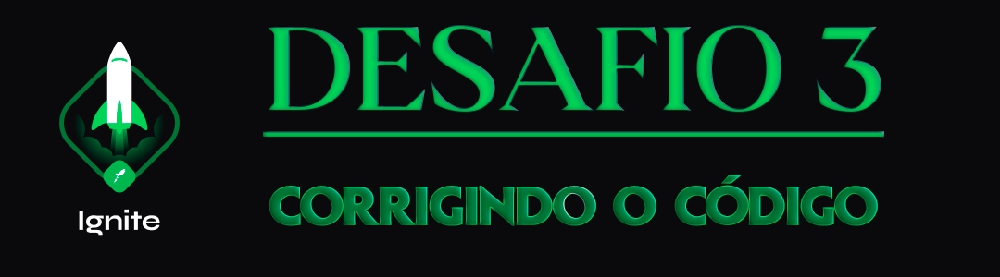

  

<h1 align="center"> RocketSeat 🚀 Ignite NodeJS 🌠</h1>

  
  
  
  

## 🧠 Detalhes do desafio

Nesse desafio, temos uma aplicação Node.js que está em processo de desenvolvimento mas que já possui os testes necessários para fazer toda a validação dos requisitos (você não deve mexer nos testes).
Após algumas alterações no código da aplicação, parte dos testes deixaram de passar e agora só você pode resolver esse problema. Bora lá? 🚀

Essa aplicação realiza o CRUD (**C**reate, **R**ead, **U**pdate, **D**elete) de repositórios de projetos. Além disso, é possível dar likes em repositórios cadastrados, aumentando a quantidade de likes em 1 a cada vez que a rota é chamada.

A estrutura de um repositório ao ser criado é a seguinte:

Descrição de cada propriedade:

- [x] **id** deve ser um uuid válido;
- [x] **title** é o título do repositório (por exemplo "unform");
- [x] **url** é a URL que aponta para o repositório (por exemplo "[https://github.com/unform/unform](https://github.com/unform/unform)");
- [x] **techs** é um array onde cada elemento deve ser uma string com o nome de uma tecnologia relacionada ao repositório (por exemplo: ["react", "react-native", "form"]);
- [x] **likes** é a quantidade de likes que o repositório recebeu (e que vai ser incrementada de 1 em 1 a cada chamada na rota de likes).

*Note que a quantidade de likes deve sempre ser zero no momento de criação.*

  

Feito com ❤️ por [Augusto Hermes](https://github.com/augustohermes) 👋.
